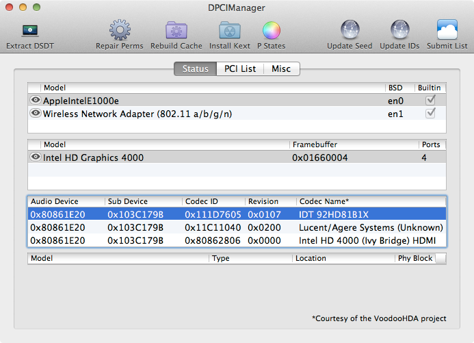
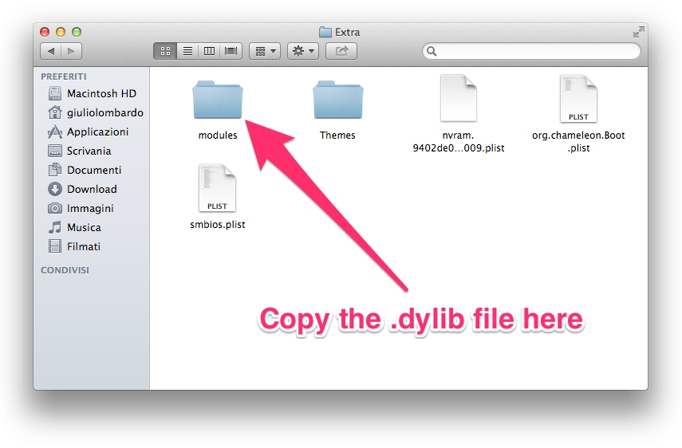
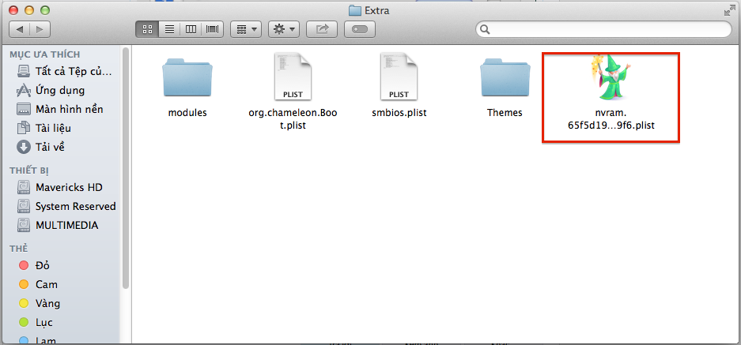

# iMessage Fix

## ⚠️ This patch only work for Chameleon Bootloader! For Clover & OC, i will have a guide later.

## 💾 Installation

* All patches file are put in this repo. Just download it and read this guide step-by-step or you can download it by click <a href="https://github.com/red-toxic/iMessage-Fix/archive/refs/heads/main.zip">this</a>. Just open folder' iMessage Fix'.

### ☑️ Step 1: En0 enable

* To enable iMessage/Facetime, your Hackintosh enthernet should be (en0) like this:

	

* Extract file 'DPCIManager.zip' and open it

* If it doesn't show en0, open finder, go to /Library/Preferences/SystemConfiguration/ and delete these file:

		+ CaptiveNetworkSupport
		+ com.apple.airport.preferences.plist
		+ com.apple.network.eapolclient.configuration.plist
		+ NetworkInterfaces.plist

* Then go to System Preferences -> Network -> Delete all network config

* Reboot your Hackintosh.

* Go to System Preferences -> Network and add enthernet first! Then open DPCIManager and check en0.

### ☑️ Step 2: Build new nvram

* Extract file 'NVFileRam.zip'. There will have 2 version. I recommend using 1.1.3. If it doesn't work, using 1.1.2.

* In each version of the directory there will be a file called FileNVRAM.dylib. Just move it to /Extra/modules/

	

* After that, go to /Extra/ and detele file nvram.*****.plist (***** is random number)

	

* After do this step, please move to step 3 and DON'T REBOOT HACKINTOSH!

### ☑️ Step 3: Debug iMessage

* Extract file 'imessage_debug.zip' and run it in Terminal (Right click-> Open) and waiting it run until done. Then reboot your PC and login your ID Apple.